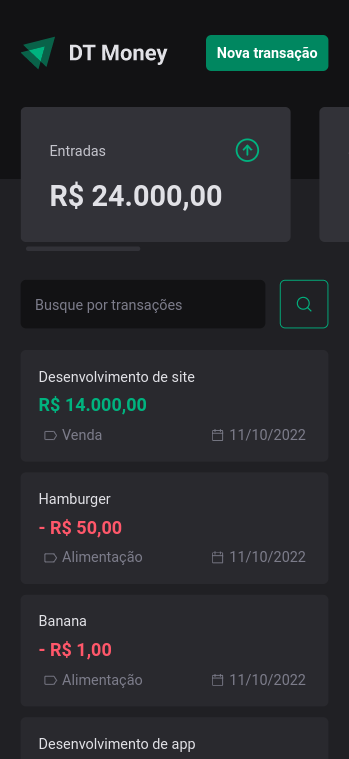
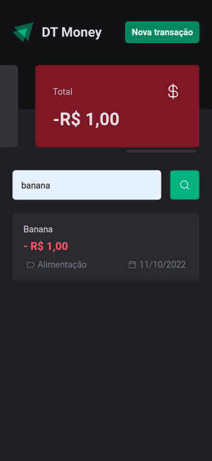
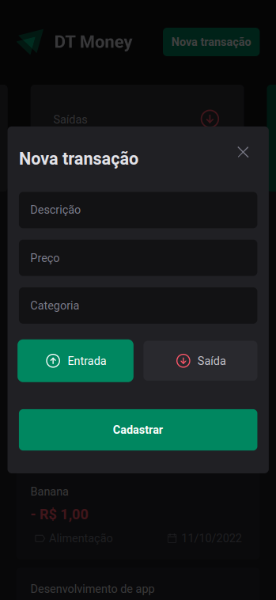
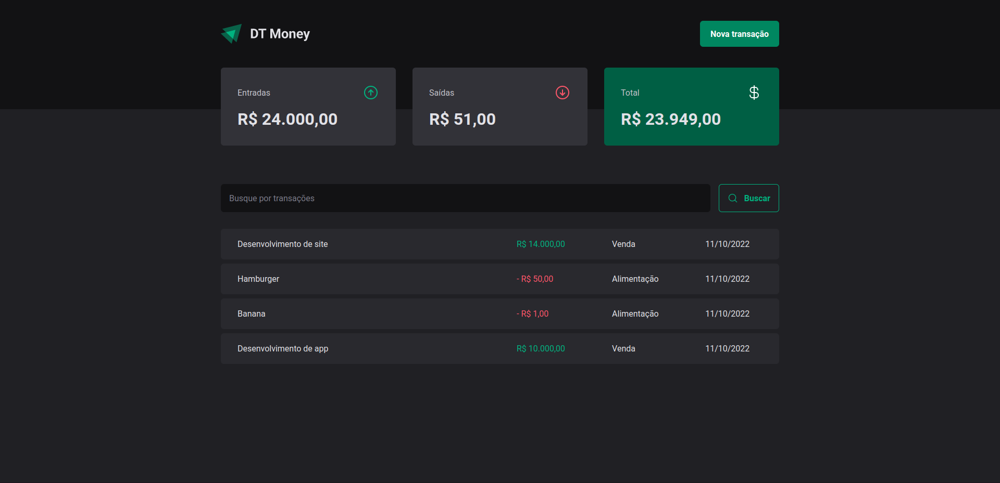
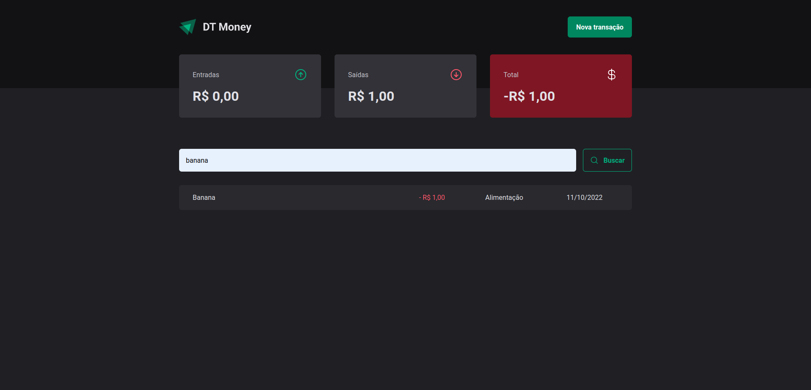
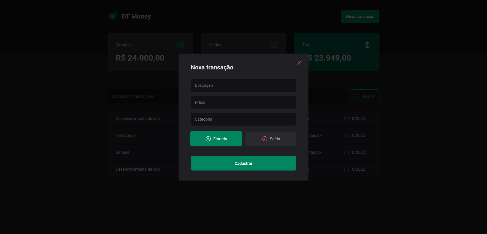

# DT MONEY

## 💻 Sobre o projeto

<p>É uma aplicação de controle de financas (entradas e saídas) que se conecta a uma API JSON Server, na qual também é aplicado tecnicas de performance em aplicaões React. </p>
<p>A versão web (Desktop) foi desenvolvida durante o modulo 03 de ReactJS da nova trilha do Ingite. Já a responsividade (web mobile) foi aplicada por mim.</p>

---

## ⚙️ Funcionalidades

- Listagem de entradas e saídas.
- Filtro de entradas e saídas.
- Valor de entradas, saídas e total.

Para o desenvolvimento foram aplicados conceitos como:
- Fetch / Axios
- Formulários
- Contextos
- Linting
- JSON server

---

## 🎨 Layout

### Web responsivo (Mobile)

<p align="center">
  

  

  
</p>

### Web (Desktop)

<p align="center" style="display: flex; align-items: flex-start; justify-content: center;">
  

  

  
</p>

---

## 🚀 Como executar o projeto
A aplicação foi desenvolvida utilizando [VITE v3.1.7.](https://vitejs.dev/)

### Pré-requisitos
Antes de começar, você vai precisar ter instalado em sua máquina as seguintes ferramentas: [Git](https://git-scm.com), [ReactJS](https://reactjs.org/). Além disso, é bom ter um editor para trabalhar com o código como [VSCode](https://code.visualstudio.com/). Também considere utilizar a documentação do [VITE](https://vitejs.dev/) para fazer alterações no projeto.

#### Rodando a aplicação web (Frontend)
```bash

# Clone este repositório
$ git clone git@github.com:evertonschultz/03-dt-money.git

# Acesse a pasta do projeto no seu terminal/cmd
$ cd 03-dt-money

# Instale as dependências
$ npm install

# Execute a aplicação em modo de desenvolvimento
$ npm run dev

# A aplicação será aberta na porta:5173 - acesse http://localhost:5173

```

---

## 🛠 Tecnologias
As seguintes ferramentas foram usadas na construção do projeto:

#### **Website**  ([VITE](https://vitejs.dev/)  +  [React](https://reactjs.org/)  +  [TypeScript](https://www.typescriptlang.org/))

-   **[Axios](https://axios-http.com/ptbr/docs/intro)**
-   **[React Hook Form](https://react-hook-form.com/)**
-   **[Styled Components](https://styled-components.com/)**
-   **[Zod](https://github.com/colinhacks/zod)**
-   **[Phosphor React](https://phosphoricons.com/)**
-   **[Use Context Selector](https://www.npmjs.com/package/use-context-selector)**
-   **[React Dialog](https://www.radix-ui.com/docs/primitives/components/dialog)**
-   **[React Radio Group](https://www.radix-ui.com/docs/primitives/components/radio-group)**
-   **[JSON Server](https://www.npmjs.com/package/json-server)**
-   **[Rocketseat ESLint](https://github.com/Rocketseat/eslint-config-rocketseat)**

---

## 🦸 Autor

 <br />
 <sub><b>Everton Schultz</b></sub></a>
 <br />

[](https://www.linkedin.com/in/https://www.linkedin.com/in/%C3%A9verton-schultz-824a1612b/)
[](mailto:evertonf.m.schultz98@gmail.com)

## Licença
Este projeto pode ser usado por qualquer pessoa! Licença MIT

